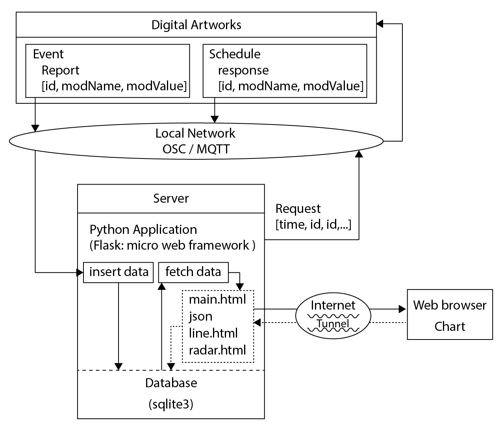

# DL4MAP
Data logger for Media/Digital Art Project

### 1. structure
</img>
<br/><br/>
</img>
<br/><br/>
### 2. dependencies
```
sudo apt-get install sqlite3
pip install flask
pip install flask-cors
pip install apscheduler
pip install pyOSC
pip install paho-mqtt
```
<br/><br/>
